<h1 valign="middle" >
  
  yorumi.nvim - deep code, quiet sea 
</h1>

**Yorumi** – a calming deep sea colorscheme for developers. 
Inspired by the tranquil night sea, Yorumi bathes your editor in a soothing blend of blues and greens, 
maintaining mellow vibes with low contrast between components. Your text stays razor-sharp and easy on the eyes (~8:1 contrast ratio), 
perfect for late-night coding marathons or when you crave a cozy nook. Less eye strain, more code magic. 
Dive into the soothing world of Yorumi and keep your coding cool.

As a longtime fan of the [Kanagawa](https://github.com/rebelot/kanagawa.nvim) theme by [rebelot](https://github.com/rebelot), 
I wanted to elevate the experience further. Yorumi offers a darker and cozier aesthetic, perfect for maintaining a sharp and serene coding environment.

## Applications and Extras

## What You'll Find Here

- **Palette Deep Dive:** Explore detailed breakdowns of each color group, complete with color codes and their roles within the scheme.
- **See It in Action:** Discover charts, color swatches, and code snippets showcasing Yorumi's elegant design.
- **Download the Goodness:** Ready to reduce eye strain? [Download Yorumi](https://github.com/yorumicolors/yorumi#extras) for your favorite developer tools and applications. Welcome to your cozier digital workspace! ❤️

- **Yorumi Website:** [https://yorumicolors.cc](https://yorumicolors.cc) – Dive deeper into Yorumi's features and inspirations.
- **Contributing:** Love Yorumi or want to contribute? [Check out the CONTRIBUTING.md](https://github.com/yorumicolors/yorumi#extras) for ways to get involved.

Yorumi transforms your coding sessions into a peaceful and focused journey. Dive in, explore the palette, and see how it complements your coding style!

## Palette

**Yorumi** features a deep sea palette, thoughtfully divided into six thematic color groups. Each group embodies different elements of the ocean to create a serene and focused coding environment. Utilize these colors to enhance various aspects of your editor, from syntax highlighting to UI components, ensuring a cohesive and visually appealing workspace.

### Yoru (夜) - Night

Embracing the tranquil darkness of the night sea.

| Color | Reference | Hex Code | Description |
|-------|-----------|----------|-------------|
| 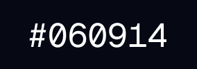 | `yoru0` | `#060914` | Ideal for the background of your editor, providing a deep, calming base. |
|  | `yoru1` | `#0C0F1A` | Perfect for inactive UI elements like status lines and inactive buffers. |
| 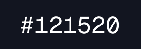 | `yoru2` | `#121520` | Use for cursor lines and background highlights to subtly differentiate active areas. |
| 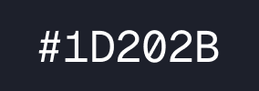 | `yoru3` | `#1D202B` | Suitable for fold columns and other auxiliary UI components to maintain a cohesive look. |

### Tsuki (月) - Moon

Capturing the ethereal glow of moonlight shimmering on water.

| Color | Reference | Hex Code | Description |
|-------|-----------|----------|-------------|
| 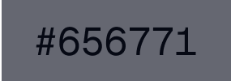 | `tsuki0` | `#797B87` | Perfect for comments and less prominent text, blending seamlessly with the background. |
| 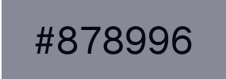 | `tsuki1` | `#90929E` | Use for keywords and operators to make them stand out without harsh contrasts. |
|  | `tsuki2` | `#A7A9B5` | Ideal for function names and variables, providing clarity and focus. |
| 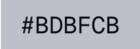 | `tsuki3` | `#BDBFCB` | Great for standard text and identifiers, ensuring high readability. |
|  | `tsuki4` | `#C6DFEC` | Excellent for hover highlights and selection backgrounds, enhancing interactivity. |

### Kuroi (黒) - Black

Reflecting the mysterious depths and shadowy hues beneath the surface.

| Color | Reference | Hex Code | Description |
|-------|-----------|----------|-------------|
|  | `kuroiRed` | `#4E0E0E` | Use for error backgrounds and critical alerts to grab attention effectively. |
| 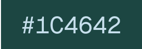 | `kuroiGreen` | `#1C4642` | Perfect for success backgrounds and Git diffs (additions) to signify positive actions. |
|  | `kuroiBlue` | `#0D2C4E` | Ideal for informational backgrounds and Git diffs (changes) to denote modifications. |
| 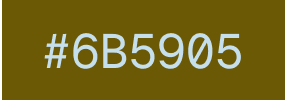 | `kuroiYellow` | `#6B5905` | Use for warnings and Git diffs (text changes) to highlight important notices. |
| 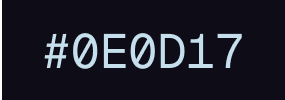 | `kuroiViolet` | `#0E0D17` | Suitable for inactive UI elements and less prominent text, maintaining a sleek interface. |
|  | `kuroiBlack` | `#121210` | Serves as the another background color, offering a dark and immersive coding space. |
| 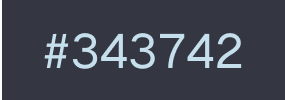 | `kuroiGray` | `#343742` | Use for conceal elements, visual separators, and non-critical text to keep the interface clean. |

### Umi (海) - Sea

Echoing the vibrant life and dynamic colors of the ocean.

| Color | Reference | Hex Code | Description |
|-------|-----------|----------|-------------|
| 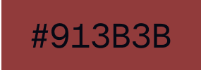 | `umiRed` | `#913B3B` | Ideal for highlights and active search matches to make them easily noticeable. |
|  | `umiOrange` | `#9C672B` | Perfect for UI elements like buttons and links, adding a touch of warmth. |
|  | `umiGreen` | `#667C4B` | Use for highlights in Git diffs (additions) and success notifications. |
|  | `umiBlue` | `#42778A` | Great for directory names and informational text, providing a calming effect. |
|  | `umiYellow` | `#9D672F` | Suitable for warnings and active lines, ensuring they stand out subtly. |
|  | `umiMagenta` | `#8D3F5A` | Use for string literals and special characters to add vibrancy without overwhelming. |
|  | `umiCyan` | `#49837E` | Perfect for variable names and annotations, enhancing clarity and focus. |

### Sango (珊瑚) - Coral

Inspired by the lively hues and intricate beauty of coral reefs.

| Color | Reference | Hex Code | Description |
|-------|-----------|----------|-------------|
| 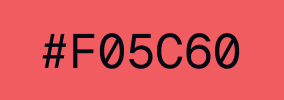 | `sangoRed` | `#F05C60` | Ideal for errors and critical alerts to immediately draw attention. |
| 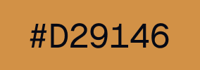 | `sangoOrange` | `#D29146` | Use for warning messages and important notices to maintain visibility without harshness. |
| 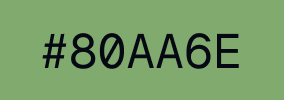 | `sangoGreen` | `#80AA6E` | Perfect for success messages and Git diffs (additions) to signify positive changes. |
|  | `sangoBlue` | `#597BC0` | Great for function names and class definitions, adding a professional touch. |
|  | `sangoYellow` | `#BA9A5E` | Use for highlight groups like `CurSearch` and `IncSearch` to ensure they are easily noticeable. |
| 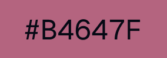 | `sangoMagenta` | `#B4647F` | Suitable for method names and decorators, adding depth to your code structure. |
| 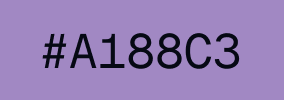 | `sangoViolet` | `#A188C3` | Use for keywords and operators to make them stand out subtly against the background. |
|  | `sangoCyan` | `#7AA8A7` | Perfect for type annotations and interface definitions, enhancing readability. |

### Kairo (海路) - Bioluminescent Sea

Capturing the mesmerizing glow of bioluminescent sea life.

| Color | Reference | Hex Code | Description |
|-------|-----------|----------|-------------|
| 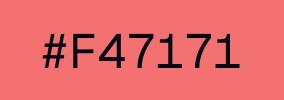 | `kairoRed` | `#F47171` | Use for inline errors and critical issues to ensure they are immediately visible. |
| 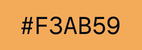 | `kairoOrange` | `#F3AB59` | Perfect for active highlights and selections, adding a vibrant touch to interactions. |
|  | `kairoGreen` | `#9CB67D` | Ideal for success indicators and Git diffs (additions), promoting a positive coding experience. |
|  | `kairoBlue` | `#788AD3` | Great for informational messages and static highlights, providing clarity without distraction. |
| 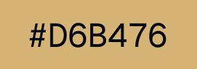 | `kairoYellow` | `#D6B476` | Use for active search highlights and substitute matches, ensuring they stand out effectively. |
| 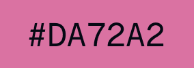 | `kairoMagenta` | `#DA72A2` | Suitable for function annotations and special variables, adding a touch of sophistication. |
|  | `kairoViolet` | `#958EBE` | Perfect for complex data structures and decorators, enhancing the visual hierarchy. |
| 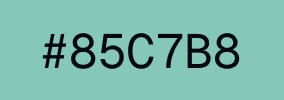 | `kairoCyan` | `#85C7B8` | Use for interface elements and type hints, providing a crisp and clear contrast for better focus. |
