<h1 valign="middle" >
  
  yorumi.nvim - deep code, quiet sea 
</h1>

> artwork from [Song of the Sea](https://www.imdb.com/title/tt1865505/)

**Yorumi** – a calming deep sea colorscheme for developers. 
Inspired by the tranquil night sea, Yorumi bathes your editor in a soothing blend of blues and greens, 
maintaining mellow vibes with low contrast between components. Your text stays razor-sharp and easy on the eyes (~8:1 contrast ratio), 
perfect for late-night coding marathons or when you crave a cozy nook. Less eye strain, more code magic. 
Dive into the soothing world of Yorumi and keep your coding cool.

As a longtime fan of the [Kanagawa](https://github.com/rebelot/kanagawa.nvim) theme by [rebelot](https://github.com/rebelot), 
I wanted to elevate the experience further. Yorumi offers a darker and cozier aesthetic, perfect for maintaining a sharp and serene coding environment.

## Applications and Extras

Ready to reduce eye strain? [Download Yorumi](https://github.com/yorumicolors/yorumi#extras) for your favorite developer tools and applications. Welcome to your cozier digital workspace! ❤️

  
  
  
  
  

  

  

  

Can't find your favorite application? 
[Request a port](https://github.com/yorumicolors/yorumi/issues/new?assignees=&labels=port&projects=&template=port-request.md&title=%5BPORT%5D+%3CAPP-NAME%3E).

Love Yorumi or want to contribute? [Find out how to get involved.](https://github.com/yorumicolors#contributing)

Yorumi transforms your coding sessions into a peaceful and focused journey. Dive in, explore the palette, and see how it complements your coding style!

## Palette

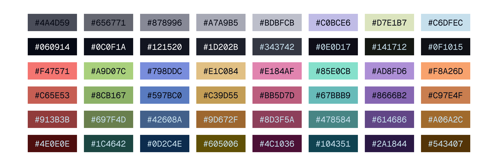

**Yorumi** features a deep sea palette, thoughtfully divided into six thematic color groups. Each group embodies a different element of the ocean to create a serene and focused coding environment. Utilize these colors to enhance various aspects of your editor, from syntax highlighting to UI components, ensuring a cohesive and visually appealing workspace.

  

    <h3>Yoru (夜) - Night</h3>   The base color group for the theme, representing dark backgrounds and neutral tones. Used for UI elements like windows, panels, and text areas to create a calm, low-contrast foundation.
  

| Color | Reference | Hex Code | Description |
|-------|-----------|----------|-------------|
| 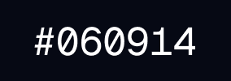 | `yoru0` | `#060914` | Main editor background. Dark, low-contrast base for the workspace. |
| 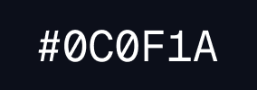 | `yoru1` | `#0C0F1A` | Background for inactive UI elements (e.g., status lines, inactive buffers). Slightly lighter than yoru0 for subtle differentiation. |
| 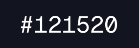 | `yoru2` | `#121520` | Background for cursor lines and highlights. Slightly lighter than yoru1 to distinguish active areas without overwhelming contrast. |
| 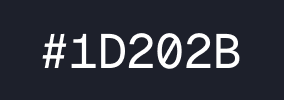 | `yoru3` | `#1D202B` | Background for fold columns and auxiliary UI elements. Maintains cohesion with the theme while providing subtle contrast. |
| 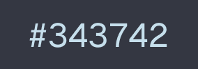 | `yoru4` | `#343742` | Used for conceal elements, visual separators, and non-critical text. Keeps the interface clean and unobtrusive. |
| 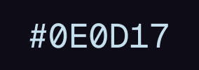 | `yorudakuViolet` | `#0E0D17` | Primary background for dialog boxes and subwindows in the alternate flavor. Also used as a main background in the secondary theme variant. |
| 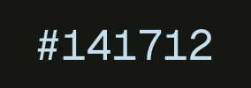 | `yorudakuGreen` | `#141712` | Background for positive indication buttons (non-hover state). Provides a subtle, affirmative visual cue. |
| 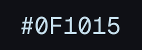 | `yorudakuBlue` | `#0F1015` | Primary background for the alternate flavor. Also used for accented button backgrounds. Slightly muted for a softer look. |
  

  

    <h3>Tsuki (月) - Moon</h3>   Foreground and text color group. Represents the soft glow of moonlight, used for primary and secondary text to ensure readability against dark backgrounds.
  

| Color | Reference | Hex Code | Description |
|-------|-----------|----------|-------------|
| 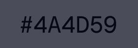 | `tsuki0` | `#656771` | Used for comments and less prominent text. Low-contrast to blend seamlessly with the background. |
| 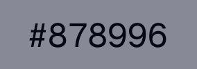 | `tsuki1` | `#878996` | Foreground for keywords and operators. Subtle emphasis without harsh contrast. |
| 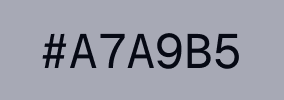 | `tsuki2` | `#A7A9B5` | Foreground for function names and variables. Ensures clarity and focus. |
| 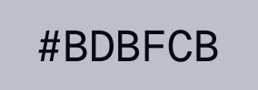 | `tsuki3` | `#BDBFCB` | Primary text color for standard text and identifiers. Optimized for readability. |
| 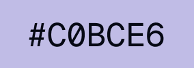 | `tsukiViolet` | `#C0BCE6` | Used for hover highlights and selection backgrounds. Enhances interactivity with a soft accent. |
| 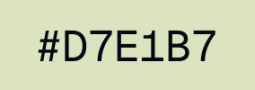 | `tsukiGreen` | `#D7E1B7` | Accent color for positive or affirmative elements. |
|  | `tsukiBlue` | `#C6DFEC` | Accent color for interactive elements. Also a primary foreground in alternate flavors. Slightly muted for versatility. |

  

    <h3>Kuroi (黒い) - Black</h3>   Dark accent color group (luminosity ~20). Used for shadows, borders, and low-contrast elements to add depth and structure without overwhelming the interface.
  

| Color | Reference | Hex Code | Description |
|-------|-----------|----------|-------------|
|  | `kuroiRed` | `#4E0E0E` | Background for errors and critical alerts. High-contrast to ensure visibility and urgency. |
| 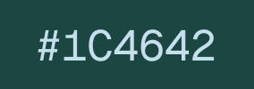 | `kuroiGreen` | `#1C4642` | Background for success states and Git additions. Indicates positive actions or changes. |
|  | `kuroiBlue` | `#0D2C4E` | Background for informational elements and Git changes. Highlights modifications or updates. |
| 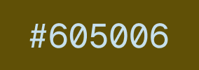 | `kuroiYellow` | `#605006` | Background for warnings and Git text changes. Draws attention to important notices. |
| 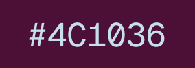 | `kuroiMagenta` | `#4C1036` | Background for warnings and Git text changes. Provides a distinct visual cue for attention. |
|  | `kuroiCyan` | `#104351` | Background for warnings and Git text changes. Adds a vibrant yet subtle highlight. |
| 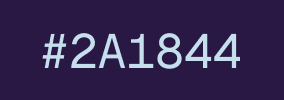 | `kuroiViolet` | `#2A1844` | Background for inactive UI elements and less prominent text. Maintains a sleek, cohesive look. |
| 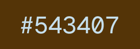 | `kuroiViolet` | `#543407` | Background for inactive UI elements and less prominent text. Adds warmth without overwhelming the interface. |

  

    <h3>Umi (海) - Sea</h3>   Mid-tone color group (luminosity ~35). Represents vibrant, dynamic accents for UI elements like buttons, highlights, and interactive components.
  

| Color | Reference | Hex Code | Description |
|-------|-----------|----------|-------------|
| 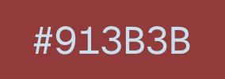 | `umiRed` | `#913B3B` | Foreground for highlights and active search matches. Ensures visibility without being overpowering. |
|  | `umiGreen` | `#697F4D` | Foreground for Git additions and success notifications. Indicates positive changes clearly. |
|  | `umiBlue` | `#42778A` | Foreground for directory names and informational text. Provides a calming, readable accent. |
|  | `umiYellow` | `#9D672F` | Foreground for warnings and active lines. Subtle yet effective for drawing attention. |
|  | `umiMagenta` | `#8D3F5A` | Foreground for string literals and special characters. Adds vibrancy while maintaining readability. |
| 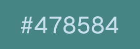 | `umiCyan` | `#478584` | Foreground for variable names and annotations. Enhances clarity and focus in code.  |
| 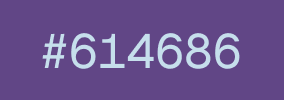 | `umiViolet` | `#614686` | Foreground for buttons, links, and interactive UI elements. Adds warmth and visual interest. |
|  | `umiOrange` | `#A06A2C` | Foreground for buttons, links, and interactive UI elements. Provides a vibrant, warm accent. |

  

    <h3>Sango (珊瑚) - Coral</h3>   Bright accent color group (luminosity ~55). Used for vibrant highlights, warnings, and interactive elements to add energy and focus to the interface.
  

| Color | Reference | Hex Code | Description |
|-------|-----------|----------|-------------|
| 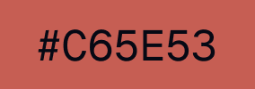 | `sangoRed` | `#C65E53` | Foreground for errors and critical alerts. High-contrast to ensure immediate attention. |
| 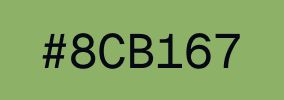 | `sangoGreen` | `#8CB167` | Foreground for success messages and Git additions. Clearly indicates positive changes. |
|  | `sangoBlue` | `#597BC0` | Foreground for function names and class definitions. Adds a professional, readable accent. |
| 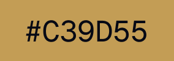 | `sangoYellow` | `#BB5D7D` | Foreground for highlights like CurSearch and IncSearch. Ensures visibility in active searches. |
| 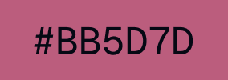 | `sangoMagenta` | `#BB5D7D` | Foreground for method names and decorators. Adds depth and structure to code. |
| 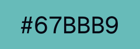 | `sangoCyan` | `#67BBB9` | Foreground for type annotations and interface definitions. Enhances clarity and focus. |
| 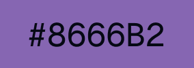 | `sangoViolet` | `#8666B2` | Foreground for keywords and operators. Subtle emphasis for better readability. |
| 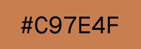 | `sangoOrange` | `#C97E4F` | Foreground for warnings and important notices. Maintains visibility without being harsh. |

  

    <h3>Kairo (海路) - Bioluminescent Sea</h3>   Bright, high-contrast color group (luminosity ~70). Used for vibrant highlights, active states, and critical UI elements to create a glowing, dynamic effect.
  

| Color | Reference | Hex Code | Description |
|-------|-----------|----------|-------------|
| 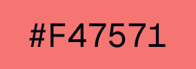 | `kairoRed` | `#F47571` | Foreground for inline errors and critical issues. High-contrast for immediate visibility. |
| 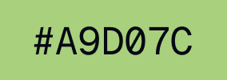 | `kairoGreen` | `#A9D07C` | Foreground for success indicators and Git additions. Clearly signals positive changes. |
| 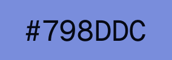 | `kairoBlue` | `#798DDC` | Foreground for informational messages and static highlights. Provides clarity without distraction. |
| 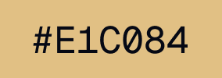 | `kairoYellow` | `#E1C084` | Foreground for active search highlights and substitute matches. Ensures visibility during searches. |
| 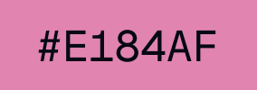 | `kairoMagenta` | `#E184AF` | Foreground for function annotations and special variables. Adds sophistication and depth. |
| 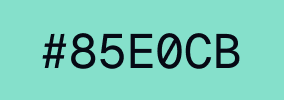 | `kairoCyan` | `#85E0CB` | Foreground for interface elements and type hints. Crisp contrast for better focus and readability. |
| 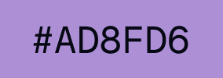 | `kairoViolet` | `#AD8FD6` | Foreground for complex data structures and decorators. Enhances visual hierarchy in code. |
| 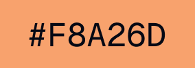 | `kairoOrange` | `#F8A26D` | Foreground for active highlights and selections. Adds vibrancy to interactive elements. |

## Contributing

We’re thrilled you want to contribute to **Yorumi**! While our team maintains the core theme, we rely on the community to expand Yorumi to more applications.

### How You Can Help

- **Submit Ports:** If Yorumi isn’t available for an application you use, feel free to create a port and submit a pull request [here](https://github.com/yorumicolors/yorumi)
- **Join the Organization:** After we transition the repository to our organization, active contributors will be granted maintainership to manage their respective ports.
